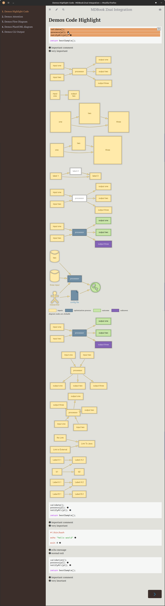

# MDBook Znai Integration

Plugin for integrating [Znai Documentation](https://testingisdocumenting.org/znai/introduction/what-is-this) into [MDBook](https://rust-lang.github.io/mdBook/).

Main features:

* integration of Java and CLI code snippets
* integration of Flow diagrams
* integration of PluntUml diagrams

## Installing

```shell
$ cargo install --git https://github.com/rust-lang/mdBook.git mdbook
$ cd .znai-plugin/bin/crawler/
$ npm install
$ cd ../../../.znai-plugin/mdbook-znai-integration
$ mvn package
$ cd ../../
$ ./run.sh
```

## Run demo

```shell
$ ./run.sh
```


